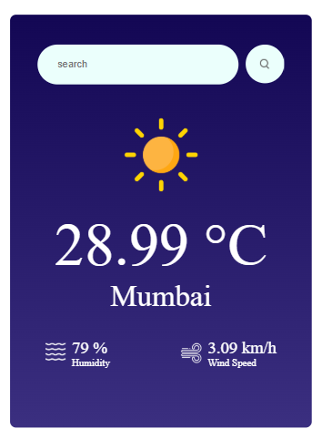

# 🌦️ Weather App

A full-stack weather application built with React and Express that displays real-time temperature, humidity, and wind data using the OpenWeather API.


## 📸 Preview

<p align="center">
  
</p>


## ⚙️ Tech Stack

- Frontend: React (Vite)
- Backend: Node.js + Express
- API: OpenWeather API


## 🚀 How to Run the Project

### 🔹 Backend

```bash
cd backend
npm install
npm run start

👉 Runs on: http://localhost:5000

### 🔹 Frontend
```bash
cd frontend
npm install
npm run dev

👉 Runs on: http://localhost:5173

### 🔐 Environment Variables
Create a .env file inside the backend folder:
OPENWEATHER_API_KEY=YOUR_API_KEY
PORT=5000


## 📁 Project Structure
weather-app/
 ├── backend/
 ├── frontend/
 ├── README.md


## ⚠️ Notes
.env file is not included in the repository
Replace YOUR_API_KEY with your OpenWeather API key


## ✨ Features
Search weather by city, state, country
Displays temperature, humidity, and wind speed
Clean UI with weather icons